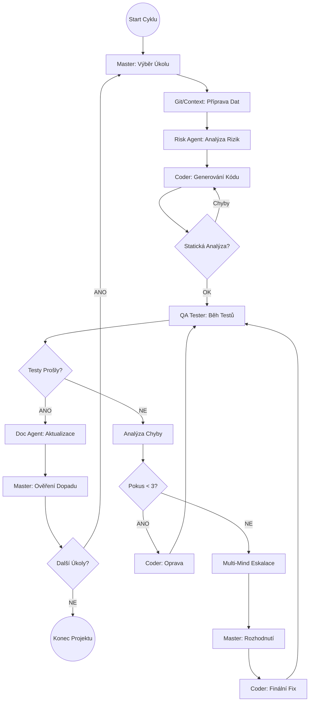

Zde je kompletní návrh vývojového flow  zpracovaný do logických kroků, tabulky zodpovědností a specifikace agentů. Návrh je založen na vaší přiložené dokumentaci a doplňuje chybějící logické vazby pro robustní autonomní systém.

### 1. Vývojové Flow (Development Flow)

Tento seznam představuje sekvenční a cyklický proces vývoje od zadání až po nasazení.

#### Fáze 1: Inicializace a Analýza Požadavků
**1. Příjem a validace zadání (Node N1-N2)**
Proces začíná, když systém obdrží vstupní data od uživatele (popis projektu, technická omezení, rozpočet). Systém provede prvotní kontrolu formátu dat a inicializuje stavovou paměť (Flow State), do které se budou ukládat všechny následné kontexty, historie rozhodnutí a metriky. V tomto bodě se zakládá "karta projektu" s unikátním ID a nastavenými limity pro iterace.

**2. Strategická analýza a identifikace rizik (Node N3)**
Hlavní supervizor (Master Agent) analyzuje zadání s cílem pochopit "CO" se má budovat, nikoliv "JAK". Identifikuje klíčové obchodní cíle, technická omezení a především nejasnosti či konfliktní požadavky. Výstupem je seznam otázek pro uživatele a seznam rizik, která by mohla projekt ohrozit (např. bezpečnostní nebo výkonnostní).

**3. Strukturování dokumentace a specifikací (Node N4)**
Na základě analýzy vytvoří dokumentační agent strukturovanou technickou specifikaci. Rozdělí požadavky na funkční (co systém dělá), nefunkční (výkon, dostupnost) a bezpečnostní. Definují se zde jasná akceptační kritéria pro každou část systému, která budou později sloužit jako "pravda" pro testovací agenty.

#### Fáze 2: Plánování a Architektura
**4. Architektonický návrh systému (Node N5)**
Architekt systému navrhne celkové řešení. Definuje komponenty, databázová schémata (tabulky, vztahy), API rozhraní a technologický stack. Součástí je i strategie nasazení a škálování. Tento krok transformuje textové požadavky na konkrétní technický plán, podle kterého se bude kódovat.

**5. Zpřesnění zadání s uživatelem (Node N6-N10)**
Pokud byly v bodě 2 nalezeny nejasnosti, systém v tomto kroku aktivně položí uživateli doplňující otázky (s nabídkou konkrétních možností A/B/C). Odpovědi jsou zaznamenány do stavu projektu a architektura je podle nich finálně upravena. Tím se předchází "halucinování" požadavků, které uživatel nechtěl.

**6. Rozpad na atomické úkoly (Node N12-N14)**
Master Agent vezme finální architekturu a rozpadne ji na seznam malých, logicky seřazených úkolů (Tasks). Každý úkol musí být atomický (zvládnutelný v jedné relaci) a mít jasně definované závislosti (např. "Task A musí být hotov před Taskem B"). Vytvoří se graf závislostí, který řídí pořadí práce.

#### Fáze 3: Implementační Smyčka (Core Loop)
**7. Výběr optimálního úkolu (Node N15-N16)**
V této fázi začíná hlavní cyklus. Master Agent vybere ze seznamu další úkol ke zpracování. Rozhoduje se na základě priorit, kritické cesty (co brzdí zbytek) a připravenosti (splněné závislosti). Pokud nejsou žádné úkoly, fáze končí. Pokud ano, systém se zaměří na jeden konkrétní task.

**8. Příprava kontextu a Git integrace (Node N17-N17.5)**
Před psaním kódu připraví Git Manager a Context Manager "pracovní stůl". Zkontrolují aktuální větev repozitáře, identifikují potenciální konflikty s jinými soubory a shromáždí relevantní kód z již hotových úkolů. Coder Agent tak dostane pouze to, co potřebuje, a neztrácí se v celém projektu.

**9. Posouzení rizik před implementací (Node N18.5)**
Bezpečnostní pojistka před psaním kódu. Risk Agent analyzuje zadání úkolu a varuje před specifickými chybami (např. "pozor na SQL injection u tohoto inputu" nebo "nezapomeň na ošetření timeoutů"). Tyto instrukce jsou přidány do promptu pro programátora.

**10. Generování kódu (Node N20-N24)**
Coder Agent napíše kód. Musí dodržet stylové konvence, použít správné knihovny a implementovat ošetření chyb. Výstupem je kompletní, spustitelný kód (nikoliv jen snippet), který je uložen jako nová verze ve stavové paměti.

#### Fáze 4: Kontrola Kvality a Testování
**11. Statická analýza kódu (Node N25.5)**
Ještě než se kód spustí, projde statickou analýzou (linting, type checking, security scan). Kontroluje se formátování, cyklomatická složitost a zjevné bezpečnostní díry. Pokud kód neprojde, vrací se okamžitě k přepracování programátorovi (rychlá smyčka zpětné vazby).

**12. Dynamické testování (Node N26-N30)**
QA Tester Agent spustí kód v izolovaném prostředí (sandbox/Docker). Provádí unit testy, integrační testy a ověřuje, zda kód splňuje akceptační kritéria z bodu 3. Pokud testy projdou, úkol je označen jako hotový. Pokud selžou, následuje analýza chyby a pokus o opravu.

#### Fáze 5: Eskalace a Řešení Problémů
**13. Opravná smyčka a Eskalace (Node N44-N53)**
Při chybě se systém pokusí kód opravit (max. 3 pokusy). Agent analyzuje chybovou hlášku a instruuje Codera k nápravě. Pokud se chyba opakuje i po 3 pokusech, aktivuje se "Multi-Mind" režim (Node N54).

**14. Multi-Mind Debata (Node N57-N79)**
V případě kritického problému svolá systém virtuální poradu. Architekt, Coder a Tester vedou strukturovanou debatu (kolo 1: analýza, kolo 2: návrh, kolo 3: konsensus). Master Agent následně vybere nejlepší řešení a nařídí jeho implementaci.

#### Fáze 6: Finalizace
**15. Aktualizace dokumentace a stavu (Node N32-N40)**
Po úspěšném dokončení úkolu se automaticky aktualizuje technická dokumentace, API specifikace (Swagger) a uživatelský manuál. Master Agent následně ověří, zda dokončení tohoto úkolu neovlivnilo plán pro zbývající úkoly, a případně přeplánuje priority.

**16. Finální validace a nasazení (Node N81-N85)**
Jakmile jsou všechny úkoly hotové, proběhne finální systémový test. Generuje se závěrečná zpráva o projektu (náklady, kvalita, pokrytí testy) a systém je označen jako připravený k nasazení (Production Ready).

***

### 2. Tabulka Zodpovědností (RACI Matrix)

| Role / Agent | Hlavní Zodpovědnost (Accountable) | Vykonává (Responsible) | Konzultován (Consulted) | Informován (Informed) |
| :--- | :--- | :--- | :--- | :--- |
| **Master Supervisor** | Celkový úspěch projektu, Výběr úkolů, Řešení konfliktů | Koordinace agentů, Přeplánování | Architekt | Uživatel |
| **Architect / Planner** | Technický návrh, Datový model | Tvorba architektury, Posouzení proveditelnosti | Security, Master | Coder |
| **Coder (App)** | Funkčnost kódu, Dodržení syntaxe | Psaní kódu, Opravy chyb (Fixes) | Git Manager, Context Mgr | Tester |
| **QA Tester** | Kvalita a stabilita | Psaní a běh testů, Analýza chyb | Coder | Master |
| **Security Agent** | Bezpečnostní integrita | Vulnerability scanning, Kontrola secretů | Architekt | Project Owner |
| **Git Manager** | Integrita repozitáře | Merge requesty, Řešení konfliktů souborů | Coder | Master |
| **Doc Master** | Aktuálnost dokumentace | Generování dokumentace, API specifikace | Všichni agenti | Uživatel |
| **Scope Guard** | Dodržení rozsahu | Kontrola "gold-plating", Validace požadavků | Master | Project Owner |

***

### 3. Diagram Flow Cyklu

Zde je vizualizace hlavního implementačního cyklu (Phase 3 & 4), který je srdcem celého procesu.

***

### 4. Seznam Agentů a Instrukce

Zde je přehled jednotlivých agentů a jejich klíčových instrukcí (System Prompts) extrahovaných z návrhu.

*   **Master Supervisor Agent**
    *   **Role:** Ředitel orchestru, stratég.
    *   **Instrukce:** "Jsi hlavní supervizor. Tvým úkolem je analyzovat požadavky, identifikovat obchodní cíle a rizika. V implementační fázi vybírej další optimální úkol na základě kritické cesty a závislostí. V případě konfliktů veď debatu a rozhodni o finálním řešení."

*   **Main Architect (Planner) Agent**
    *   **Role:** Hlavní architekt, designér systému.
    *   **Instrukce:** "Jsi vedoucí architekt. Navrhni celkovou architekturu systému, definuj komponenty, databázová schémata a API rozhraní. Identifikuj technická rizika. Při eskalaci posuzuj problémy z pohledu návrhu a integrity systému, nikoliv jen kódu."

*   **Coder Agent**
    *   **Role:** Seniorní vývojář.
    *   **Instrukce:** "Jsi Coder Agent. Tvým úkolem je generovat produkční Python/JS kód. Čti zadání úkolu, kontext a analýzu rizik. Dodržuj PEP 8 / clean code, implementuj ošetření chyb a logování. Nevymýšlej si nové požadavky. Při opravách měň pouze to, co je nutné k fixu."

*   **QA Tester Agent**
    *   **Role:** Inženýr kvality testování.
    *   **Instrukce:** "Jsi QA Tester. Tvým úkolem je nekompromisně testovat kód. Piš a spouštěj unit testy a integrační testy. Pokud test selže, poskytni přesnou analýzu chyby (stack trace, root cause) a navrhni opravu. Nepropouštěj kód, který nesplňuje akceptační kritéria."

*   **Git Manager Agent**
    *   **Role:** Správce verzí a integrace.
    *   **Instrukce:** "Jsi Git Manager. Před kódováním zkontroluj stav větve a identifikuj modifikované soubory, které by mohly způsobit konflikt. Připrav strategii pro merge. Po dokončení kódu zajisti čistou integraci do repozitáře."

*   **Context Manager Agent**
    *   **Role:** Kurátor informací.
    *   **Instrukce:** "Jsi Context Manager. Připrav pro Codera co nejefektivnější kontext (max 3000 tokenů). Vyber jen relevantní kusy kódu, závislosti a poučení z předchozích chyb. Nezahlcuj programátora celou codebase."

*   **Risk Assessment Agent**
    *   **Role:** Bezpečnostní a technický auditor.
    *   **Instrukce:** "Jsi Risk Assessor. Předtím, než Coder začne psát, identifikuj bezpečnostní zranitelnosti (SQLi, XSS, secrets), výkonnostní hrdla a anti-patterny. Vytvoř seznam mitigačních strategií, které musí Coder dodržet."

*   **Documentation Agent**
    *   **Role:** Technický spisovatel.
    *   **Instrukce:** "Jsi Documentation Agent. Po každém úspěšném úkolu aktualizuj API dokumentaci (OpenAPI), uživatelský manuál a status projektu. Udržuj dokumentaci živou a synchronizovanou s kódem."