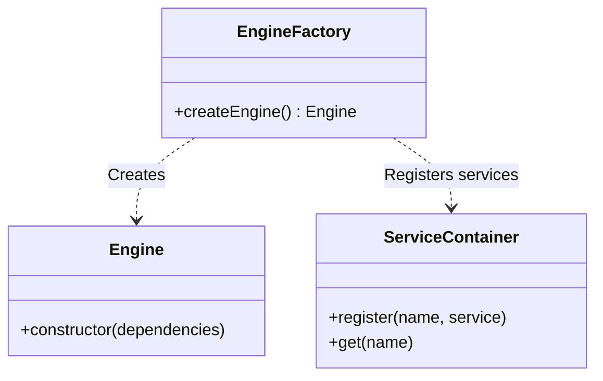
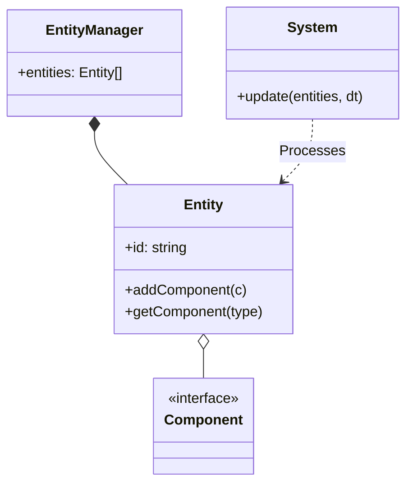
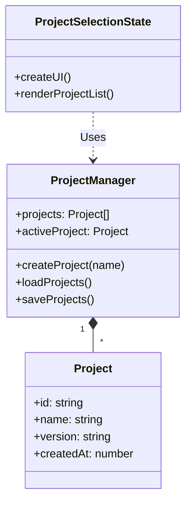

# Architecture Documentation

**Poslední aktualizace / Last Update:** 2026-01-02

## Core Architecture

### Dependency Injection (DI) & Factory Pattern

Abychom dosáhli volné vazby (Loose Coupling) mezi komponentami, používáme **Factory Pattern** a **Dependency Injection**.

To achieve Loose Coupling between components, we use **Factory Pattern** and **Dependency Injection**.

- **EngineFactory**: Statická továrna zodpovědná za vytváření instance `Engine` a všech jeho závislostí.
- **ServiceContainer**: Jednoduchý DI kontejner pro globální přístup ke službám (pokud je potřeba).
- **EngineDependencies**: Rozhraní definující závislosti, které `Engine` potřebuje.

## ECS Architecture (Entity Component System)

Jádro enginu je postaveno na ECS, což umožňuje vysokou modularitu a výkon.

The engine core is built on ECS, allowing high modularity and performance.

- **Entity**: Pouze ID (kontejner).
- **Component**: Pouze data (Transform, Physics, Script, Render).
- **System**: Pouze logika (PhysicsSystem, RenderSystem, ScriptSystem).

## Scripting System

Skriptovací systém umožňuje definovat chování entit pomocí izolovaných skriptů.

The scripting system allows defining entity behavior using isolated scripts.

- **IScript**: Rozhraní pro životní cyklus (onStart, onUpdate).
- **ScriptContext**: Fasáda (Facade) pro bezpečný přístup k API enginu.
- **ScriptManager**: Registr dostupných skriptů.

### Bezpečnost / Safety
Skripty nemají přímý přístup k instanci `Engine`. Interakce probíhá výhradně přes `ScriptContext`, což zabraňuje nechtěným modifikacím jádra.

Scripts do not have direct access to the `Engine` instance. Interaction occurs exclusively via `ScriptContext`, preventing unwanted core modifications.

## Profiling & Debugging

Pro optimalizaci výkonu engine obsahuje integrovaný profiler.

For performance optimization, the engine includes an integrated profiler.

- **Profiler**: Singleton měřící FPS a časy (update/render).
- **DebugOverlay**: Vykresluje statistiky přímo na canvas.

## Správa Projektů / Project Management

Engine podporuje správu více projektů. Každý projekt je samostatná entita s vlastní konfigurací.

The engine supports multiple project management. Each project is a separate entity with its own configuration.

### Komponenty / Components
- **ProjectManager**: Singleton třída spravující životní cyklus projektů (CRUD). Ukládá metadata projektů (localStorage/JSON).
- **ProjectSelectionState**: Herní stav (State) poskytující UI pro výběr a správu projektů.

