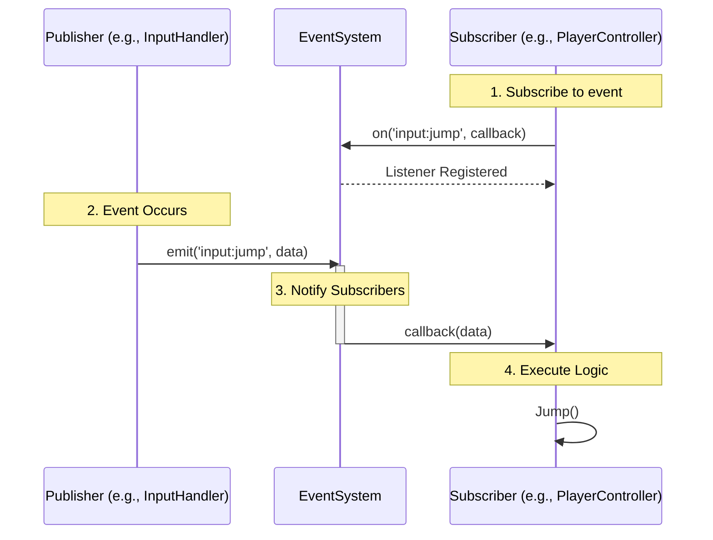
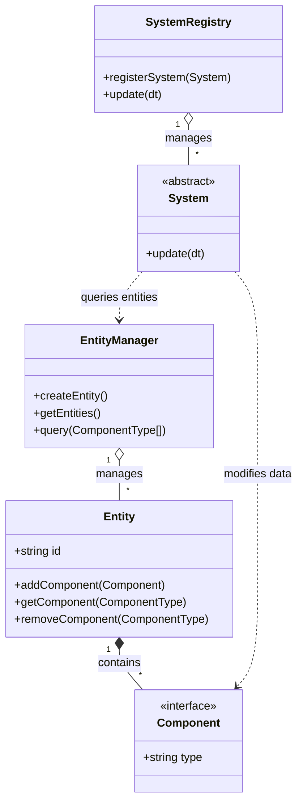
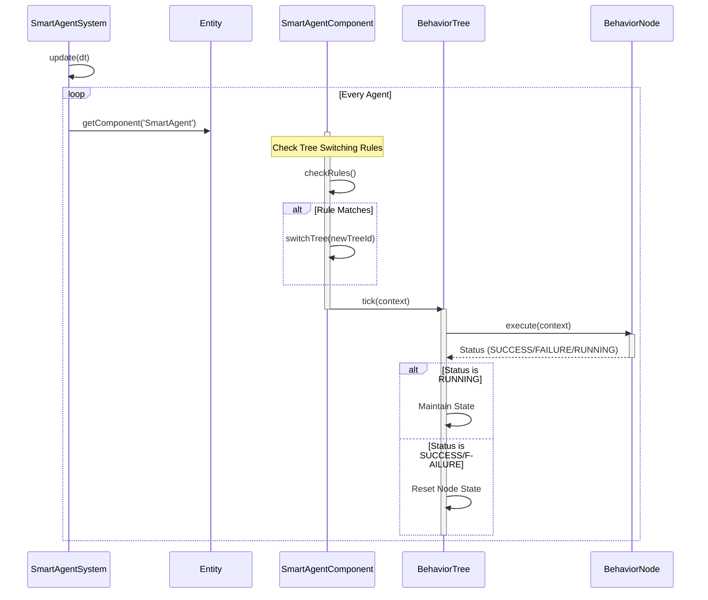
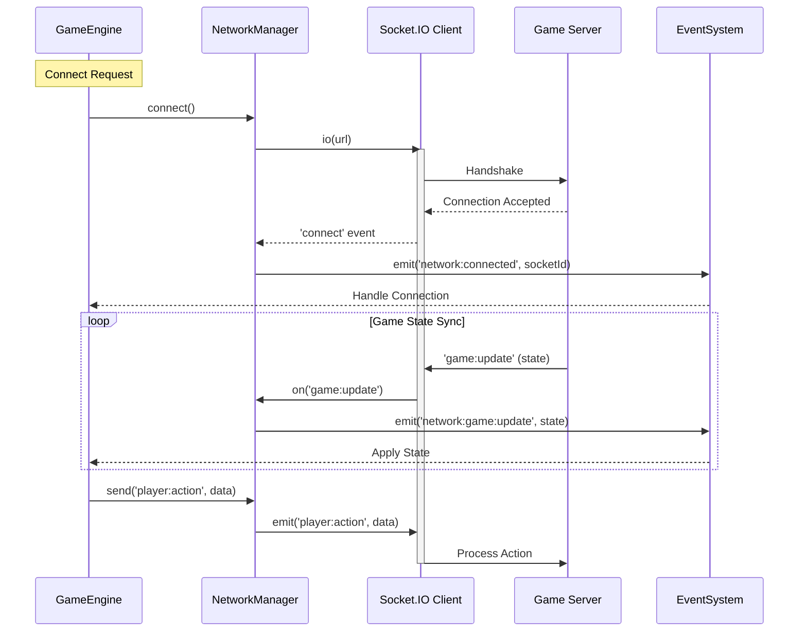
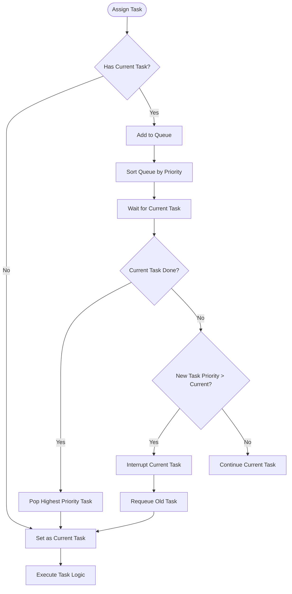

# Architektonické Diagramy (Architecture Diagrams)

Tento dokument obsahuje diagramy klíčových procesů v `game-engine-2d`. Diagramy jsou definovány v syntaxi **Mermaid**.

## 1. Životní cyklus Enginu (Engine Lifecycle)

Tento diagram popisuje inicializaci, herní smyčku a ukončení aplikace.

```mermaid
flowchart TD
    A([Start]) --> B[Engine Constructor]
    B --> C[Initialize Config & Logger]
    C --> D[Initialize Core Systems\n(Events, Audio, ECS)]
    D --> E[Register Components]
    E --> F[Register Systems]
    F --> G[Initialize Renderer & Inputs]
    G --> H{Game Loop Running?}
    
    H -- Yes --> I[Update Phase]
    I --> J[Calculate DeltaTime]
    J --> K[Update Inputs]
    K --> L[Update GameState]
    L --> M[Update Systems (ECS)]
    M --> N[Render Phase]
    N --> O[Clear Screen]
    O --> P[Render Scene & Entities]
    P --> Q[Render UI & Debug]
    Q --> H
    
    H -- No --> R[Stop Loop]
    R --> S([End])
```

## 2. Event System (Observer Pattern)

Sekvenční diagram ukazující, jak komponenty komunikují přes centrální EventSystem.



## 3. Entity Component System (ECS) Struktura

Vztahy mezi Entitami, Komponentami a Systémy.



## 4. Načítání zdrojů (Resource Loading)

Proces načítání assetů přes ResourceManager.

```mermaid
flowchart LR
    Request[Game Request Asset] --> Check{In Cache?}
    Check -- Yes --> Return[Return Cached Asset]
    Check -- No --> Load[Load from URL]
    Load --> Type{Asset Type}
    
    Type -- Image --> NewImg[new Image()]
    Type -- Sound --> AudioMgr[AudioManager.load]
    Type -- JSON --> Fetch[fetch API]
    
    NewImg --> OnLoad[onload Event]
    OnLoad --> Cache[Store in Map]
    AudioMgr --> Cache
    Fetch --> Cache
    
    Cache --> Return
```

## 5. AI Behavior Tree Vyhodnocení (Evaluation)

Proces rozhodování agenta pomocí Behavior Tree.



## 6. Síťová Komunikace (Network Flow)

Proces připojení a synchronizace přes NetworkManager.



## 7. Logika Přiřazování Úkolů (Task Assignment)

Rozhodovací strom pro TaskComponent.


