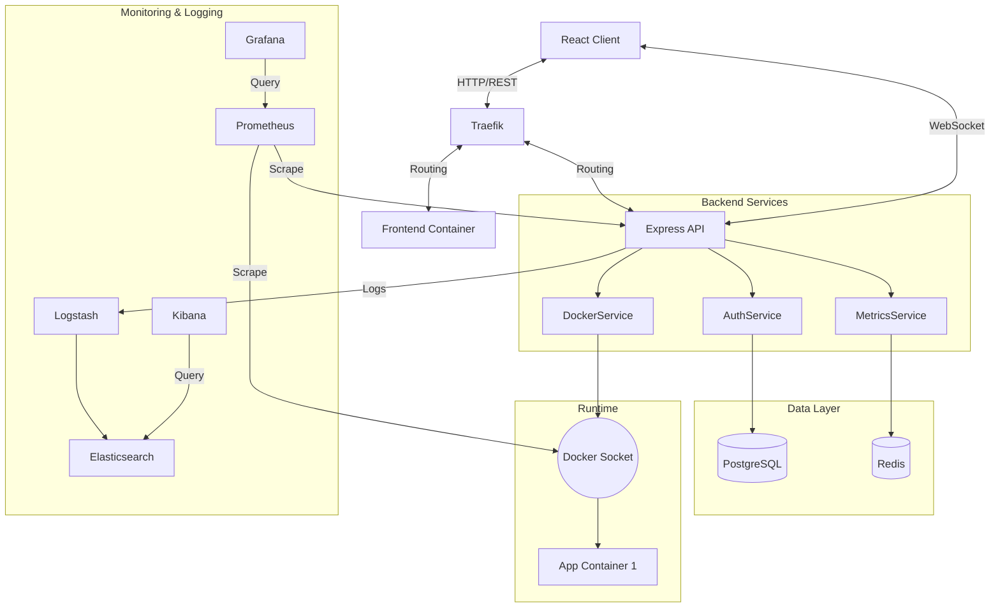

# Architecture Design: Longin Hosting

## 1. System Overview
Longin Hosting follows a microservices-inspired monolithic architecture where the backend acts as the central orchestrator between the user, the database, and the Docker daemon. It includes a comprehensive monitoring and logging stack.

## 2. Component Diagram

## 3. Key Services
### 3.1 AuthService
- Handles Registration, Login, Token Refresh.
- Middleware for protecting routes.
- Password hashing using bcryptjs.

### 3.2 DockerService
- Wraps `dockerode` library.
- Manages container lifecycle (Start, Stop, Restart, Remove).
- Handles image pulling and volume management.
- Enforces resource limits (CPU/RAM).

### 3.3 MetricsService
- Collects stats from running containers every 30s.
- Pushes hot data to Redis/WebSocket.
- Persists historical data to PostgreSQL.
- Exposes system metrics via `/metrics` for Prometheus.

## 4. Infrastructure
- **Containerization:** All services run in Docker.
- **Orchestration:** Docker Compose (Development/Production).
- **Networking:** Internal `longin-network`.
- **Reverse Proxy:** Traefik v2 handling routing and load balancing.

### Ports & Services
- **Traefik:** 80 (HTTP), 443 (HTTPS), 8080 (Dashboard)
- **Frontend:** 3000 (Internal)
- **Backend:** 3001 (Internal)
- **PostgreSQL:** 5432
- **Redis:** 6379
- **Prometheus:** 9090
- **Grafana:** 3003
- **Elasticsearch:** 9200
- **Kibana:** 5601

## 5. Security
- **JWT:** Short-lived access tokens, long-lived refresh tokens.
- **Docker Socket:** Protected access, strictly controlled by backend.
- **Environment Variables:** All secrets managed via `.env`.
- **Network Isolation:** Backend services on internal network, exposed only via Traefik.
