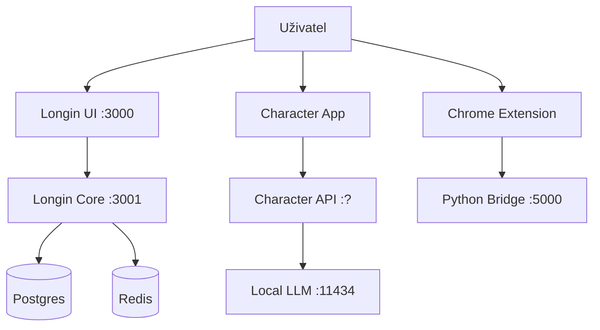
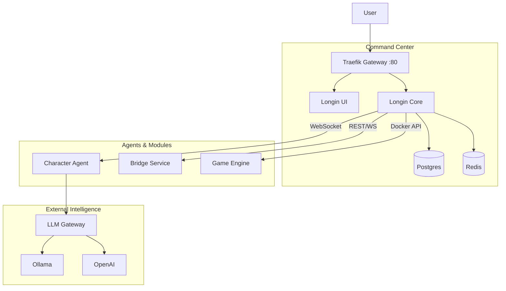

# Integrační Mapa a Diagram Závislostí

## Současný Stav (Fragmentovaný)

## Chybějící Propojení
1. **Character <-> Core**: Charakter neví o stavu systému (deploymenty, notifikace).
2. **Bridge <-> Core**: Data z prohlížeče se nedostávají do centrální paměti.
3. **Game Engine <-> Core**: Hry nejsou spravovány centrálním dashboardem.

## Cílový Stav (Integrovaný)

## Datové Toky
1. **Centrální Paměť**: Všechny moduly (Character, Bridge) by měly ukládat dlouhodobá data do Core Postgres databáze přes API.
2. **Event Bus**: Redis Pub/Sub pro komunikaci mezi moduly v reálném čase.
